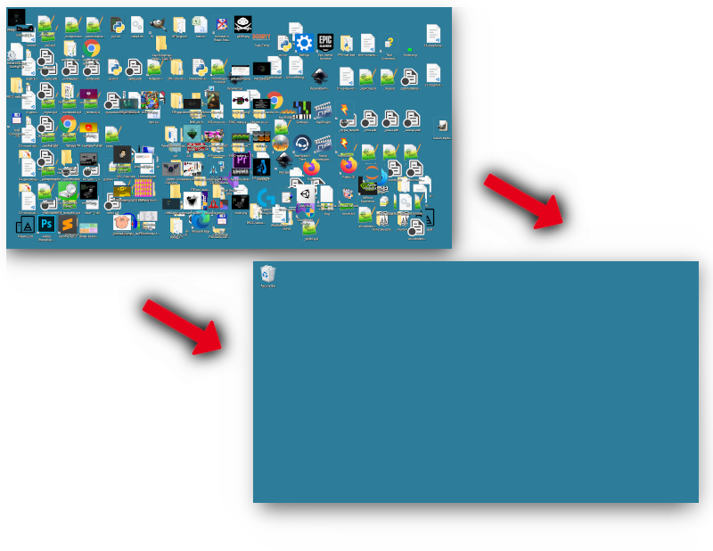
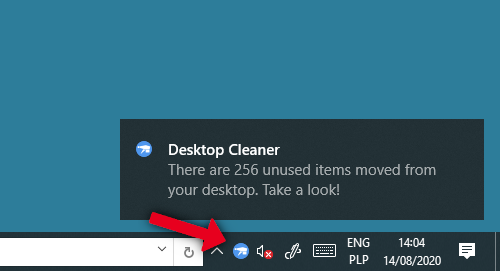

# Desktop Cleaner

## Table of contents

- [What is it?](#what-is-it)
- [Usage](#usage)
    - [Executables](#executables)
    - [Python script](#python-script)
    - [Adding to start-up](#adding-to-start-up)
    - [Configuration](#configuration)
    - [Logging](#logging)
- [Further improvements](#further-improvements)

## What is it?

**Desktop Cleaner** is a Windows software which automatically keeps old, unused, files and folders away from your desktop. If you are a type of person whose desktop sometimes looks like in the picture below, you should consider having a look at this program.



The script works in a background and observes creation, modification and access dates of files and folders on your desktop. The Cleaner **doesn't remove** any of your files, it only moves them to the target directory so as to keep your watching directory tidy. It supports a tray icon which allows some basic controls and notifies you, when a certain number of unused files have been moved.



## Usage

### Executables
Go to the releases tab in this repository and download the newest version. Unpack the archive and place all files somewhere on your disk.

### Python script
Install modules from `requirements.txt` and run `desktop_cleaner.py`.

### Adding to start-up
Enter `Windows + R`, type `shell:startup` and add there a shortcut to your `desktop_cleaner.exe`. If you are using python, create a Batch file.

### Configuration
Next to the main executable, there is a `config.yaml` file which is loaded every time the Cleaner performs scanning:
```
watching_path: "C:/Users/Szymon/Desktop"
destination_path: "D:/stuff"
move_file_after_hours: 8
notify_after_files: 10
items_ignore:
    - "desktop.ini"
    - "Google Chrome.lnk"
    - "tools"
```

- **watching_path** - a path the Cleaner is watching. If empty, uses a path to the current user's desktop.
- **destination_path** - a path the Cleaner is copy to. If empty, creates `desktop_cleaner` directory in `watching_path`.
- **move_file_after_hours** - time in hours which has to elapse to move the file.
- **notify_after_files** - if such number of files are placed in the `destination_path`, the Cleaner emits a notification.
- **items_ignore** - list of files and directories which are ignored while scanning.

### Logging
Every action the Cleaner performs is logged in the `desktop_cleaner.log` file:
```
2020-08-13 20:53:03,094 INFO: Moving '\Users\Szymon\Desktop\Slajd8.PNG' (last used 7561.8h ago) to \Users\Szymon\Desktop\desktop_cleaner\Slajd8.PNG
2020-08-13 20:53:03,096 INFO: Moving '\Users\Szymon\Desktop\Slajd9.PNG' (last used 7561.8h ago) to \Users\Szymon\Desktop\desktop_cleaner\Slajd9.PNG
2020-08-13 20:57:03,097 INFO: There are 25 unused items moved from your desktop. Take a look!
2020-08-13 20:55:03,121 INFO: Moving '\Users\Szymon\Desktop\alex4' (last used 7514.8h ago) to \Users\Szymon\Desktop\desktop_cleaner\alex4
2020-08-13 20:55:03,789 WARNING: Permission error occured while moving '\Users\Szymon\Desktop\alex4' to '\Users\Szymon\Desktop\desktop_cleaner\alex4'
```

## Further improvements

- Ignore files/directories greather than *x* GB (*x* configurable via config).
- More intelligent scanning - Let's take an example. You have a file somewhere on a disk which was created, modified and accessed a very long time ago. You manually **move** this file to your desktop (thus, the dates stay the same as before). The Cleaner founds your file, checks the dates, and decides to move it from your desktop because of the old dates.
- Add some tray icon menu options (`Show logs`, `Add every item to ignore`, `Add specified item to ignore`, `Configure`)
- <sub><sup>Amazing deep neural network algorithm which will classify files to the various categories.</sup></sub>
